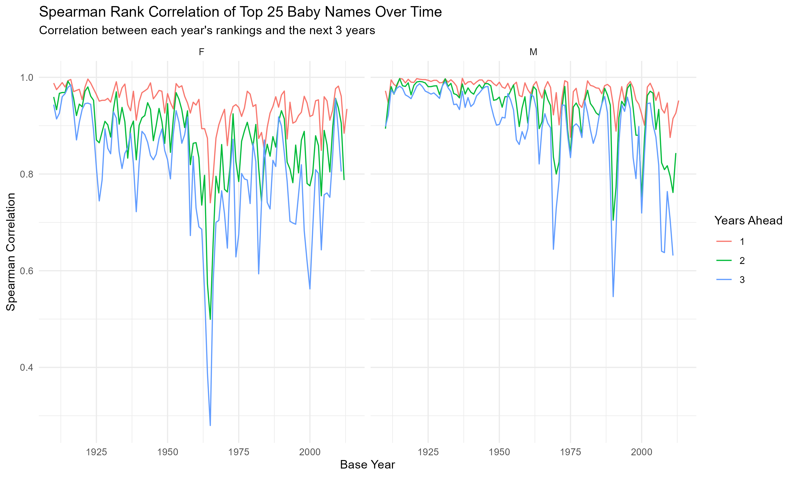
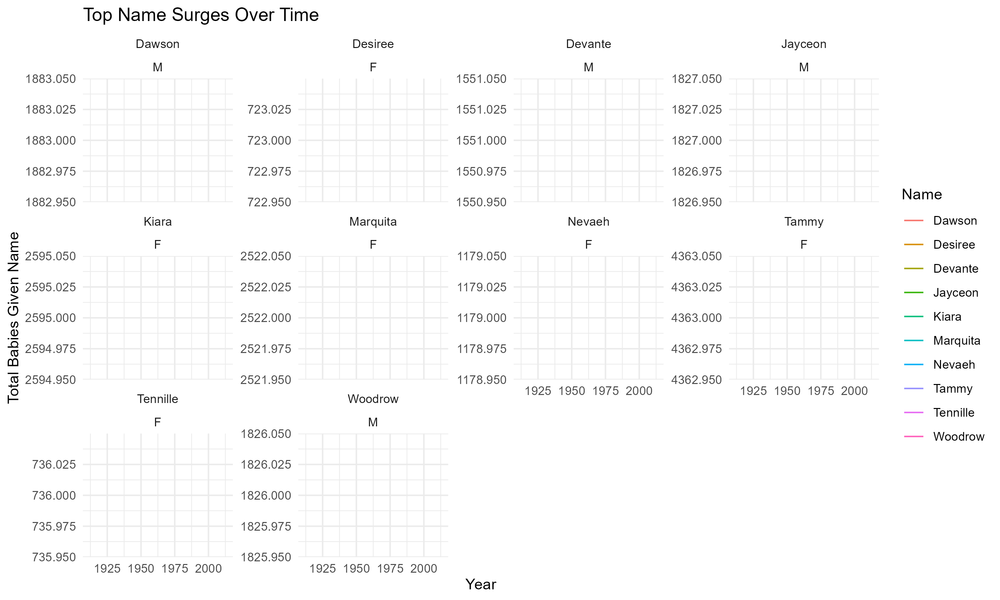

\newpage

# Introduction

This report explores US baby naming trends from 1910–2014 to identify patterns in naming persistence and cultural influences behind sudden name surges. Using the provided datasets and supplementary media data, I investigated how names rise and fall in popularity and what drives those changes.


# Methodology
## I used the following data:

- **Baby_Names**: Count of names by state, year, and gender.

- **Top_100_Billboard**: Weekly Billboard songs since 1958.

- **HBO_titles, HBO_credits**: TV character data with IMDb scores.

## And using this, I examined :

 - Name persistence using Spearman rank correlation over consecutive years.

 - Name spikes via year-on-year changes.

 - Cultural drivers by cross-referencing media influence.
 

\newpage
# Results: Spearman Correlation of Top 25 Names
```{r}

```

## Summary:

We can see that both male and female names show strong short-term persistence, particularly over 1–2 years.However, over longer gaps (3+ years), this consistency slightly weakens, with female names showing more fluctuation. Notably, there’s a sharp dip in correlation for female names around 1950, suggesting a possible shift in naming preferences or a broader cultural change during that time.

\newpage
# Results : Top Name surges over time
```{r}

```

These year-on-year name surges highlight the impact of societal events and media exposure on naming decisions. I examined the top 10 names with the greatest year on year growth in count and investigated likely cultural explanations using public knowledge and media trends.

## From the above figure we can uncover several interesting naming insights :

**1. Nevaeh (F)**  

The name Nevaeh saw a sharp surge in the early 2000s and by doing some research I can speculate as to why. Navaeh is simply Heaven spelled backwards.Sonny Sandoval, the lead singer of group P.O.D took this clever play on words and named his daughter Nevaeh in 2000. He discussed it on MTV's *Cribs* during the same year. This might be the reason **Navaeh** saw a spike in the early 2000s.

This name illustrates how even personal celebrity moments can influence national naming trends.

**2. Jayceon (M)**  

The name "Jayceon" saw a noticeable rise in the early to mid-2010s, and this was likely linked to the West Coast rapper The Game, real name **Jayceon Terrell Taylor**. He was a major figure in hip-hop since the mid-2000s, and his continued presence in the spotlight made the name more visible. This is a further reflection of how influential music artists can be in shaping trends, inspiring parents, and making uncommon names popular.

**3. Devante (M)**  

The name "DeVante" started gaining traction in the 1990s, and this was likely thanks to DeVante Swing, a standout member of the iconic R&B group Jodeci. With R&B culture booming during that decade, especially in urban communities, names like DeVante carried a sense of style and was even more proof that pop culture and music often leave their mark on baby name trends.

**4. Kiara (F)**  

The name "Kiara" saw a rise in the late 1990s, and this was most probably linked to the Disney film **The Lion King II: Simba’s Pride (1998)**, where Kiara is Simba’s daughter. It being a sequel to a beloved classic led to it resonating with a generation that grew up on the original, showing how animated movies, especially nostalgic ones can shape naming choices and leave lasting cultural footprints.

**5. Desiree (F)**  
The name "Desirée" saw a spike between the 1970s and 1980s, and this was might have been influenced by media references like the 1954 film *Desirée*, which featured Napoleon’s lover, or later mentions in TV or music. It reflects how romantic, elegant names tied to fictional figures can re-emerge long after their original moment. 


To dig deeper, we explored whether these naming spikes aligned with Billboard hits or major HBO titles during those years.


```{r}
top_surges_summary <- read.csv("Figures/top_surges_summary.csv")
knitr::kable(top_surges_summary, caption = "Summary of Top Name Surges and Media Links")
```

From the above table we can see that : 

- All 10 names that experienced the largest year-on-year surges in popularity     had clear associations with mainstream media, either through Billboard         chart hits or HBO shows/movies.

- HBO Link Examples:

The name Tammy appears in multiple HBO series during the 1980s and 1990s, likely aligning with visibility in adult television content. The spikes 

The name Woodrow features in historical or political dramas. This is consistent with naming patterns influenced by serious roles or periods.

- Billboard Mentions:

Desiree and Devante were tied to 90s R&B culture — particularly through artists like Jodeci and Des'ree who were active during their spikes.

Jayceon, as mentioned, aligns with the rapper The Game, whose peak years coincide with the surge.

Marquita may reflect naming influence from lesser-known hits or regional artist recognition not immediately visible in national charts.

Patterns & Hypothesis :

The synchrony of name surges and cultural media activity supports the agency's hypothesis that children’s names are indeed influenced by pop culture visibility.

Names influenced by music and TV show characters appear to enjoy temporary spikes but may lack long-term persistence unless reinforced (e.g., Tammy had multiple resurgence periods).

Business Takeaway/Insights:

For the toy design agency, understanding which media formats (TV, music) drive naming trends can aid in selecting names that will resonate with the market.
These findings could guide branding strategies, packaging, and even character development decisions tied to name trends.

