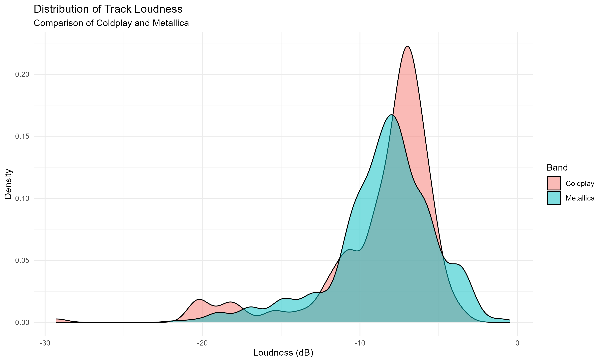
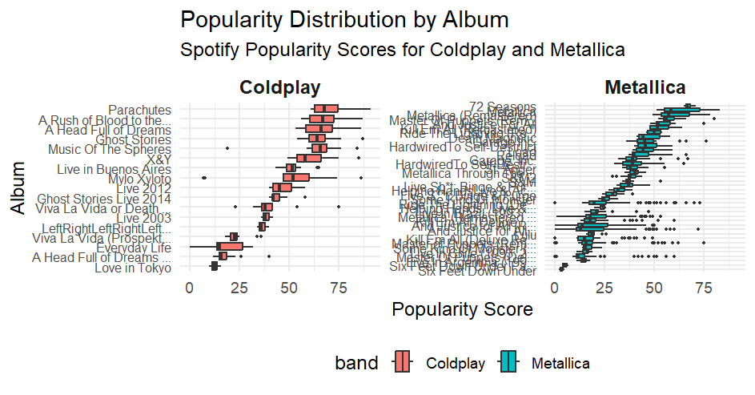
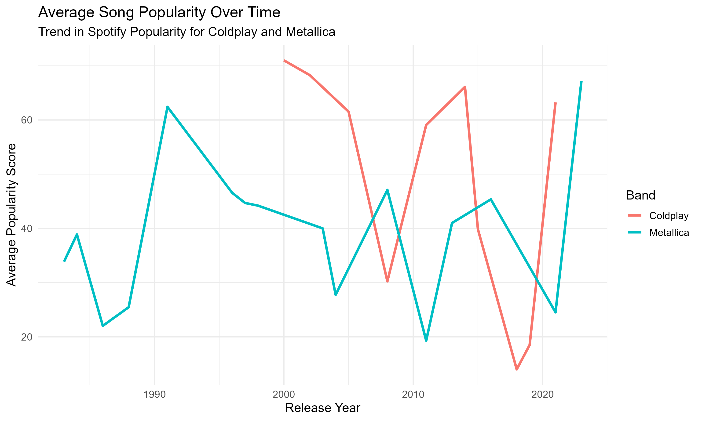
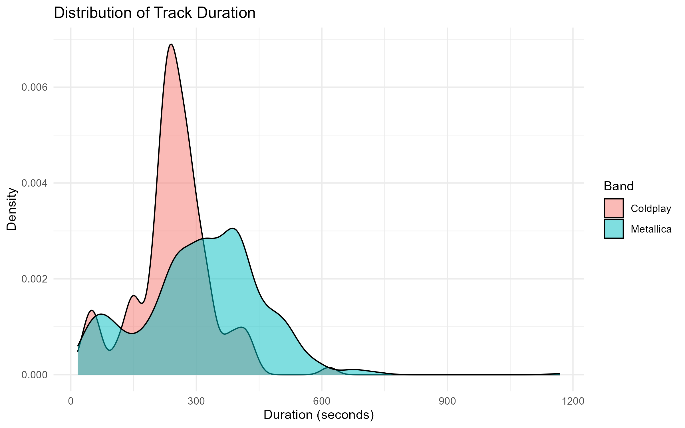
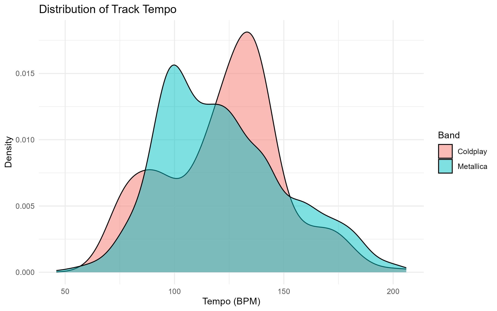
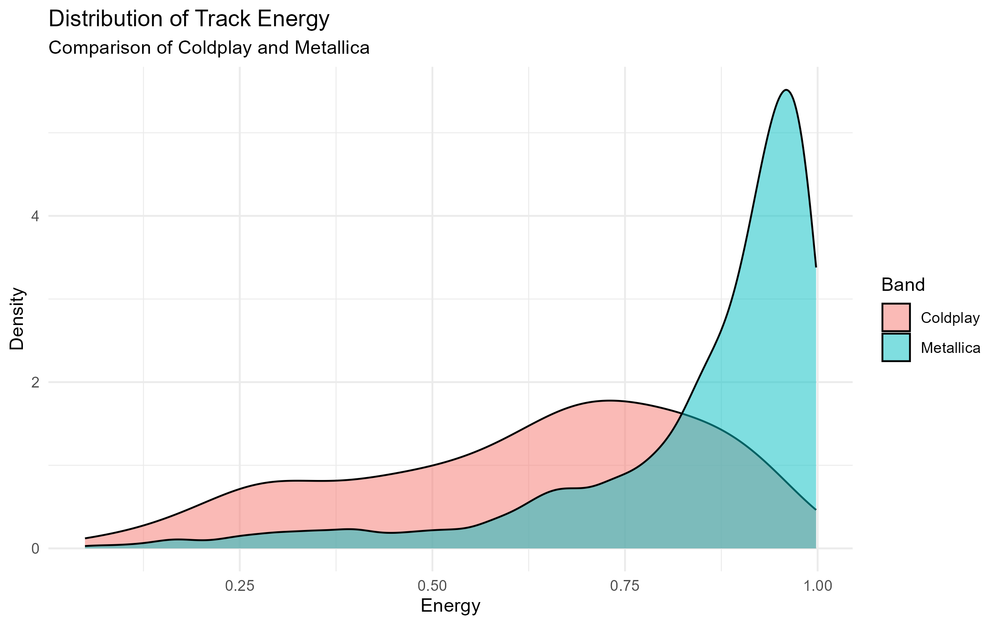
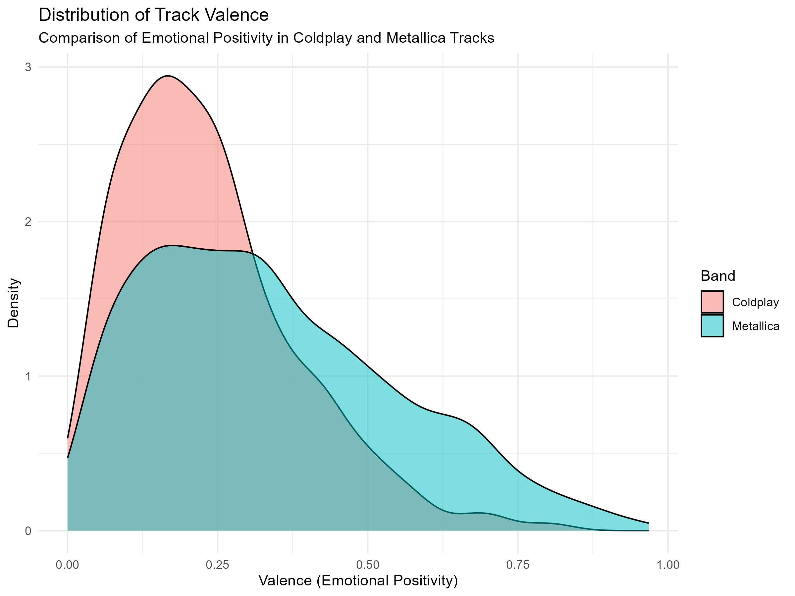
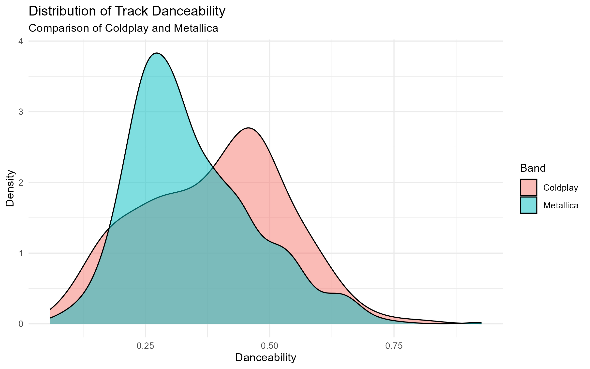

\newpage

# Introduction

This analysis explores musical trends using Spotify and other music datasets. Specifically, I compared the musical journey and popularity of **Coldplay** and **Metallica**, two globally recognized bands with different stylistic and generational appeal.

The focus includes:

- Popularity distributions across albums
- Trends in popularity over time
- Track-level insights to assess consistency and longevity


# Data Preparation

I begin by cleaning and preparing the datasets for both bands. This is to ensure 3 things. These are : 

- Live/demo/remix tracks are excluded
- Duration is converted from milliseconds to seconds
- A uniform structure with columns: `name`, `album`, `release_date`, `popularity`, `duration_sec`, `band`

All transformations were done using `dplyr`, and the final datasets were merged into a single frame for comparison.


# Distribution of Popularity by Album

The first plot visualizes how track popularity is distributed across each band’s albums. This helps identify standout releases and assess consistency within albums.

```{r album-popularity-image, echo=FALSE, out.width="95%", fig.cap="Spotify popularity scores across albums for each band"}

```


# Key insights 
- Coldplay shows tight, consistently high distributions —             particularly in albums from the 2010s onward.

- Metallica’s popularity is more variable, with certain re-releases   achieving sharp spikes.

- Suggests Coldplay's relevance in the streaming era, while           Metallica thrives from legacy hits

\newpage

# The next plot improves interpretability by grouping albums per band and simplifying text formatting:
```{r}

```

# Additional Insights
- For Coldplay, the uniformity in boxplots across albums highlights   consistent production of broadly appealing songs.

- For Metallica, albums like Metallica (Remastered) show wide         variability — suggesting a few standout tracks dominate streaming.

- Faceting also helps isolate band-specific patterns without          confusing overlap.

\newpage 

# Popularity trends over time 
To evaluate each band's musical longevity, I calculated the average popularity score per year of release.

```{r}

```

# Key Insights
- Coldplay’s popularity has remained stable post-2008, reflecting     consistent success in new releases.

- Metallica shows sporadic, almost random surges, often aligned with anniversary     reissues or cultural rediscovery.

- Coldplay appears more adapted to modern streaming cycles;           Metallica’s peaks are nostalgic.


\newpage
## Track Duration and Tempo Analysis

### Track Duration Distribution

This figure compares the distribution of track durations (in seconds) for Coldplay and Metallica. It helps us understand the typical length of songs produced by each band.

```{r fig.align="center", echo=FALSE, out.width="80%"}

```

# Insights:

- Metallica's songs generally span a wider range and lean toward      longer durations, with some tracks well above 400 seconds. This     aligns with the band's progressive metal style and extended         instrumental sections.

- Coldplay tends to produce songs with more consistent,               radio-friendly lengths, often clustering around 230–250 seconds.

\newpage
# Track Tempo Distribution
Another important characteristic we examined was the **tempo** (measured in BPM).
This density plot compares the tempo (in beats per minute) of tracks by each band.
```{r}

```

# Insights:

- Metallica songs often cluster around higher tempo ranges (100–140   BPM), consistent with their aggressive and energetic sound.

- Coldplay shows greater variability in tempo. Some songs fall into   slower ballad territory (under 90 BPM), while others match the     upbeat energy of mainstream pop rock.

\newpage
### Track Energy Comparison

We compared the distribution of **track energy** between Coldplay and Metallica, using Spotify's energy score (ranging from 0 to 1).

- Metallica tracks generally exhibit **higher energy**, consistent with their heavier musical style.
- Coldplay's energy scores tend to be lower on average, reflecting a more mellow or ambient style.

This contrast is clearly visible in the density plot below:

```{r, echo=FALSE, out.width="80%"}

```

\newpage
# Valence Distribution
Valence describes the musical positivity conveyed by a track — a higher value means the song sounds more cheerful or happy, while a lower value suggests sadness, tension, or anger.

The valence score in Spotify data quantifies the emotional positivity of a track, ranging from 0 (very negative or sad) to 1 (highly positive or cheerful). This helped me to assess whether Coldplay or Metallica tends to produce more emotionally uplifting music.

```{r}

```

# Interpretation : 

- Coldplay generally scores higher on valence, with a denser         concentration of songs in the higher positivity range (e.g.,       0.6–0.9). This aligns with their reputation for uplifting,         melodic, and emotionally resonant pop-rock tracks.

- Metallica, on the other hand, has a broader distribution skewed    toward lower valence scores. This reflects their heavier, darker,   and more aggressive musical tone, typical of the metal genre.

This figure simply shows us that Coldplay’s musical identity leans toward emotional optimism, while Metallica gravitates to intensity and depth. These emotional profiles not only differentiate the bands stylistically but also reflect how they connect with different audiences across time.

\newpage
# Distribution of Track Danceability
I compared how "danceable" the music of Coldplay and Metallica is, based on Spotify's audio features. Danceability is a numerical measure (0–1) of how suitable a track is for dancing, based on tempo, rhythm stability, beat strength, and regularity.

```{r}

```

# Key Insights:

- Coldplay tracks generally show higher danceability scores,         clustering more tightly toward the upper end of the scale.

- Metallica on the other hand exhibits a broader, flatter            distribution, indicating a more varied range in danceability —     likely due to their heavier, more complex musical style.

This difference suggests that Coldplay’s music may be more aligned with pop and electronic influences, while Metallica’s catalog features styles less oriented toward rhythmic danceability.


### Distribution of Track Loudness

Loudness refers to the overall decibel level of a track. Metal tracks are typically more compressed and louder, while pop and ambient music might have a wider dynamic range.

```{r track_loudness_plot, echo=FALSE, message=FALSE, warning=FALSE}

```

# Key Insights:
- Metallica shows a clearly louder profile, with most tracks         peaking between -4 dB and -6 dB.

- Coldplay spans a wider range of loudness values, with many songs   being softer (around -9 dB).

This aligns with the genre difference — Metallica's heavier sound benefits from high compression, while Coldplay balances dynamics and melody.

\newpage

## Summary of Audio Features by Band

The table below compares average values of key Spotify audio features for each band.

```{r audio_feature_summary, echo=FALSE}
summary_data <- read.csv("Figures/audio_feature_summary.csv")
knitr::kable(summary_data, caption = "Average Audio Feature Values: Coldplay vs Metallica")
```


### Closing Remarks 

From the visualizations and summary table, clear differences emerge between Coldplay and Metallica, highlighting how genre influences shape musical style. Coldplay’s tracks tend to be more positive and uplifting, reflected in their higher valence scores, while Metallica leans toward darker emotional tones. Metallica also stands out for its significantly higher energy and loudness levels, aligning with its heavy metal roots. In contrast, Coldplay shows slightly greater danceability, likely due to its evolving incorporation of pop elements in recent years. While both bands share similar tempo ranges, Coldplay’s songs are generally longer in duration. These contrasts not only illustrate the distinct musical identities of the bands but also help quantify their stylistic evolution over time—serving as a creative, data-driven lens through which to appreciate their enduring impact on modern music.
