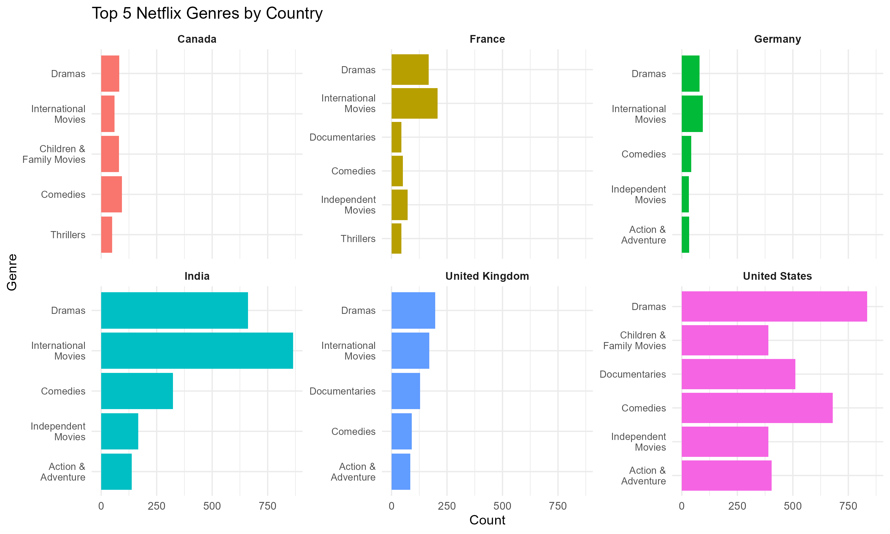
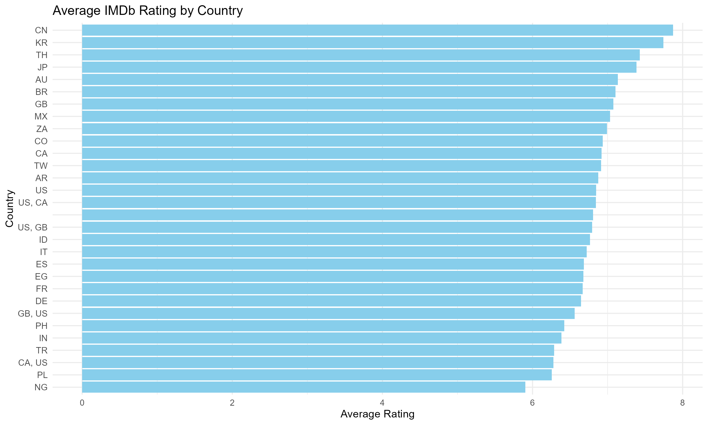
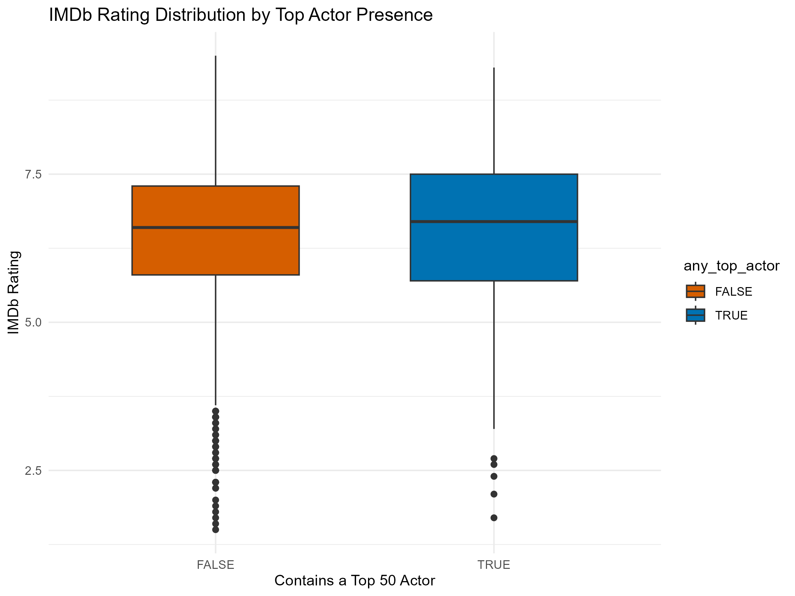
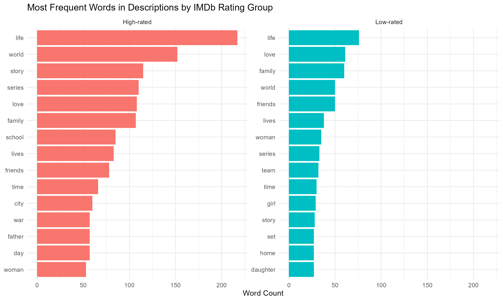
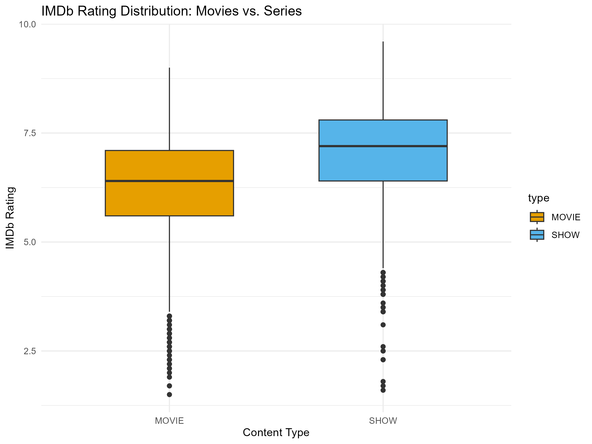

\newpage
**Introduction**

This analysis investigates the types of content available on Netflix up to 2023, based on data provided from IMDb. The goal is to generate insights that can inform strategic decisions around launching a new streaming service. We explore trends in genres, ratings, movie durations, and keywords from descriptions, and compare patterns across countries.

**Top Genres by Country**

The visualization below showcases the five most frequent Netflix genres for a selection of countries. This helps highlight differences in regional content preferences and potential gaps in localized offerings.

```{r genre-by-country, echo=FALSE, out.width="90%", fig.cap="Top 5 Most Common Netflix Genres by Country"}

```

Interpretation
- India exhibits a strong preference for International Movies and     Dramas, suggesting a high consumption of global content.

- The United States emphasizes Dramas, Documentaries, and Comedies,   pointing to demand for both entertainment and informational         content.

- France and Germany have relatively niche top genres, possibly due   to regional cultural tastes.

- Canada and the UK display more balanced genre distributions,        though Dramas remain consistently popular.

These variations are useful for tailoring content strategies by region — e.g., investing more in international licensing for India, or original documentaries in the U.S.

\newpage
**Identifying how IMDb ratings of Netflix titles vary by country. This helps inform which regions have a catalog of critically acclaimed content and where there may be room for quality improvement**

```{r imdb-avg-rating-plot, echo=FALSE, out.width="95%", fig.cap="Average IMDb rating of Netflix titles by production country"}

```
The bar chart above illustrates the average IMDb ratings of Netflix titles by their production countries. Countries like China (CN), South Korea (KR), and Japan (JP) stand out with some of the highest average ratings, exceeding 7.5, suggesting that content from these countries is often highly regarded by viewers.

On the other end of the spectrum, countries like Nigeria (NG) and Poland (PL) appear to have lower average ratings, though this could be influenced by smaller sample sizes or specific genres dominating those countries' outputs.

Some of the country labels appear as combinations (e.g., 'US, GB' or 'CA, US'), indicating joint productions. These mixed entries highlight the collaborative nature of modern film and television content but may also complicate country-specific interpretation slightly.

Overall, this plot is useful for understanding which countries consistently produce highly-rated content, helping guide acquisition or production strategies for a new streaming service.

\newpage
**Star Power and IMDb Ratings**
One hypothesis commonly held in the entertainment industry is that casting star actors can significantly enhance a film's success. To test this, we explored whether the presence of frequently appearing actors in Netflix movies is associated with higher IMDb ratings.

I defined "top actors" as the 50 most frequently appearing actors across Netflix movies in the dataset, based on IMDb credits data. Each movie was flagged based on whether any of these top 50 actors appeared in its cast. We then examined the distribution of IMDb ratings for movies with and without these top actors.


```{r fig.cap="IMDb Rating Distribution by Top Actor Presence", echo=FALSE, out.width="80%"}

```

As the plot shows, movies that feature at least one of the top 50 actors tend to have **slightly higher median IMDb ratings** and a **more consistent distribution** of scores. These movies also appear to avoid very low outliers more frequently than those without any top actors.

However, the overlap in distributions suggests that while **star power may contribute positively**, it is **not a strong determinant** of movie success on its own. Casting well-known actors might help improve audience perception or baseline quality, but **strong storytelling and direction remain key drivers** of highly rated content.

This insight supports the view that top actors add value, but should be part of a **broader quality strategy** rather than a standalone solution.

\newpage
**Text Themes in Content Descriptions**

To better understand the thematic elements that resonate with and attract audiences, I conducted a **text analysis** of the descriptions attached to Netflix titles. I focused on comparing the language used in:

- **High-rated content** (IMDb score > 7.5)
- **Low-rated content** (IMDb score < 5)

Using tokenization and stop-word removal, I isolated the most frequently occurring words in each group and visualized the top 15 from both using the figure below.

```{r fig.cap="Most Frequent Words in High- vs Low-Rated Content Descriptions", echo=FALSE, out.width="85%"}

```
# The results highlight some interesting contrasts:

- Words like “story”, “school”, “friends”, and “series” appear        frequently in high-rated content, often pointing to personal or     emotionally touching narratives.

- On the other hand, low-rated content tends to recycle more general   terms like “set”, “team”, “home”, and “girl”. This possibly         indicates more generic or less compelling plot descriptions.

- Interestingly, words like “life”, “love”, and “family” appear in    both groups, suggesting they are widely used but not always an      indicator of quality.

This analysis suggests that word choice in a movie/show’s description may correlate with how audiences perceive its depth or appeal. Streaming platforms might consider optimizing synopsis language to highlight narrative richness and emotional themes.

\newpage
**Movies vs. Series: Which Performs Better?**

To assist our client in deciding whether to prioritize episodic content or films, I compared the IMDb rating distributions of **movies** versus **TV series** available on Netflix.

```{r fig.cap="IMDb Rating Distribution: Movies vs. Series", echo=FALSE, out.width="80%"}

```

The boxplot reveals a notable difference: That is series tend to be rated higher than movies, with a median IMDb score of 7.2 versus 6.4 for movies. Series also exhibit a tighter, more favorable distribution, with fewer low-rated outliers. This suggests that episodic storytelling may provide greater engagement or satisfaction for viewers.This is definitely an insight worth considering when designing content portfolios.

\newpage
**Conclusion**

This analysis explored the key features that drive engagement and perceived quality on Netflix, using IMDb data:

- Genres and countries reveal cultural preferences in content        consumption.

- Star power (based on top 50 actor frequency) has a modest but      visible positive impact on ratings.

- Textual analysis shows that high-rated content often emphasizes    emotional, character-driven themes.

- TV series consistently outperform movies in user ratings.

For a streaming startup, this suggests that focusing on high-quality, emotionally resonant series featuring recognizable talent could be a strategic advantage. However, success depends not just on format or cast, but on clear storytelling and user-aligned themes.
