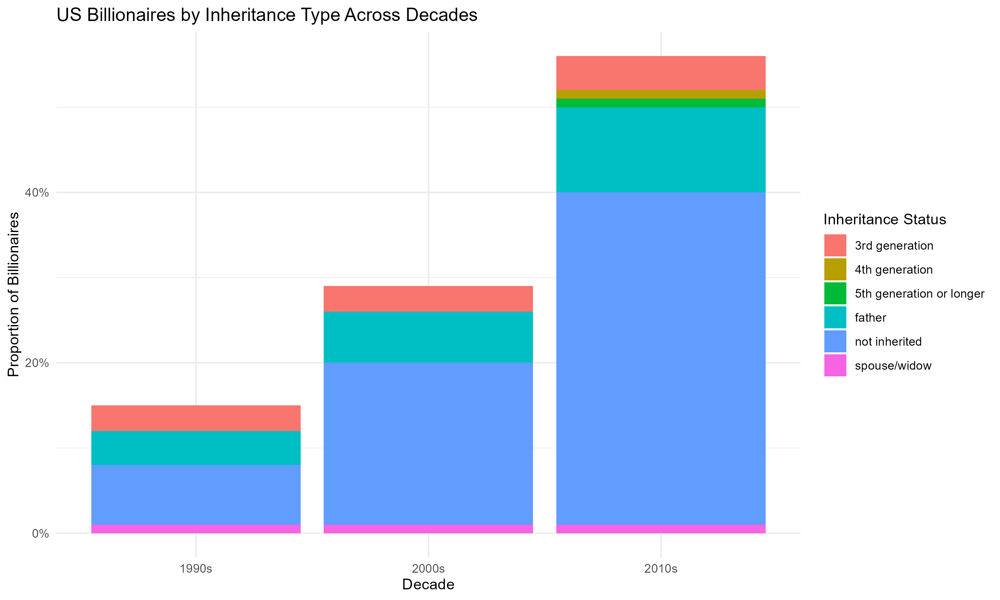
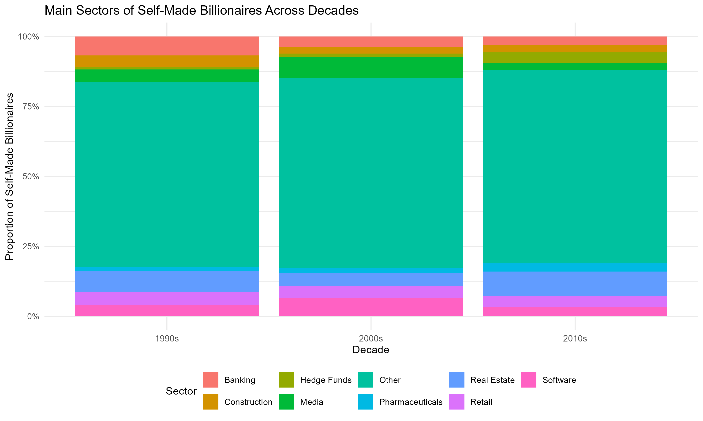
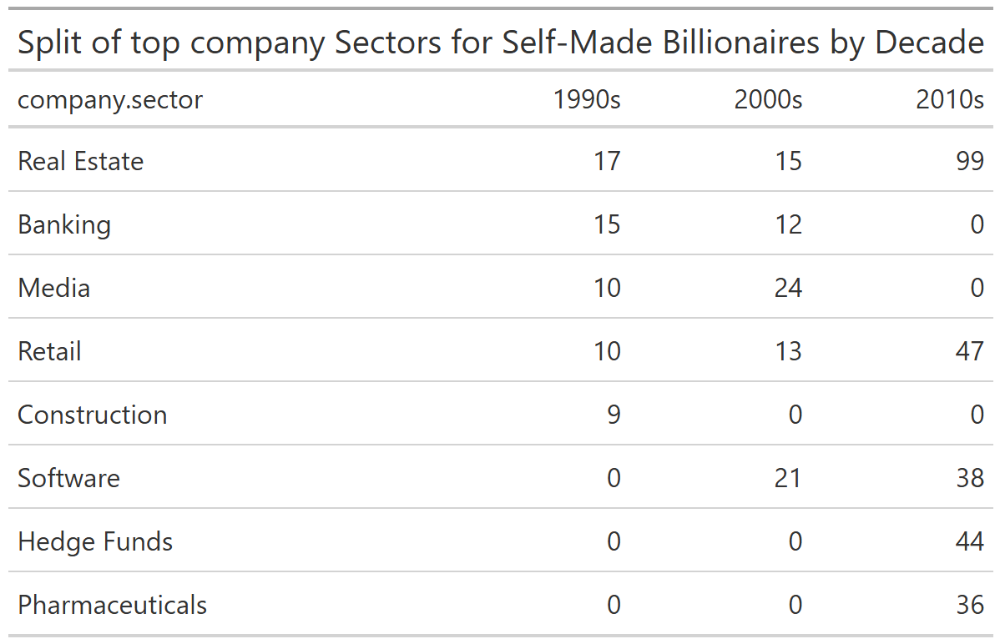

\newpage

# Billionaires

In this question, I explored wealth accumulation patterns among billionaires across different decades and countries. The dataset provided spans the 1990s, early 2000s, and mid-2010s, offering a rich foundation to investigate shifting trends in how wealth is acquired and inherited.

I have been tasked with testing two key claims:
1. That in the **United States**, more billionaires have emerged over time without significant generational wealth ties.
2. That **self-made millionaires are increasingly associated with software and technology**, a shift from earlier decades where consumer services were more dominant.


## 1) Inheritance Trends Among US Billionaires

In this section, we investigate the claim that in the US, there has been a rising number of new billionaires with minimal generational wealth ties. Specifically, we analyse how the type of wealth inheritance has shifted across the 1990s, 2000s, and 2010s.

```{r us-inheritance-trends, echo=FALSE, out.width="90%", fig.cap="US Billionaires by Inheritance Type Across Decades"}

```

The stacked bar plot above illustrates the proportion of US billionaires across different inheritance statuses over three decades. A clear increase in self-made wealth (marked as "not inherited") is visible over time, particularly from the 1990s to the 2010s. This trend supports the initial hypothesis that the US has seen a rise in billionaires with limited reliance on generational wealth. Despite the presence of inherited wealth (from father or multi-generational lines), the growth in non-inherited wealth suggests a shift toward entrepreneurial success.

## 2) Sector/industry trends amongst billionaires 
```{r}

```

The chart above shows a clear shift in the industries producing self-made billionaires. In the 1990s, Real Estate and Banking dominated. By the 2010s, Software and Hedge Funds rose significantly, reflecting a trend toward innovation and finance-driven wealth creation. 

So while the representation of technology-related sectors like Software and Pharmaceuticals had grown by the 2010s, traditional sectors such as Real Estate and Retail still dominate across decades. This suggests that the innovation-driven sector trend was emerging but not yet dominant.

\newpage

To further evaluate the claim that most self-made billionaires are in software and innovation-driven industries, we analyzed the top sectors for self-made billionaires across the 1990s, 2000s, and 2010s.

```{r self-made-sectors-plot, echo=FALSE, fig.cap="Main Sectors of Self-Made Billionaires Across Decades"}

```

This table provides a clearer view of dominant sectors. Notably, Real Estate appears consistently in all decades, while Software, Hedge Funds, and Pharmaceuticals gain prominence only in the 2000s and 2010s. 

This structured evidence shows that while innovation sectors were rising, they had not fully eclipsed traditional wealth-generation paths, especially in the earlier decades.

\newpage

**Conclusion**

My investigation of the Forbes billionaire dataset revealed two compelling trends. Firstly, the U.S. had indeed seen a steady rise in self-made billionaires. By the 2010s, over 40% of U.S. billionaires were not beneficiaries of inherited wealth, marking a clear generational shift toward self-acquired fortunes.

Secondly, the distribution of company sectors among self-made billionaires has evolved. Traditional sectors like real estate and retail remained prominent in the 1990s, but by the 2010s, innovation-driven industries such as software, hedge funds, and pharmaceuticals emerged among the top sectors. This supports the hypothesis that economic success today is increasingly tied to innovation and intellectual capital rather than legacy business models.

All in all, these findings highlight the changing nature of wealth creation, with the study supporting investment, policy, and education in fostering entrepreneurial success.

