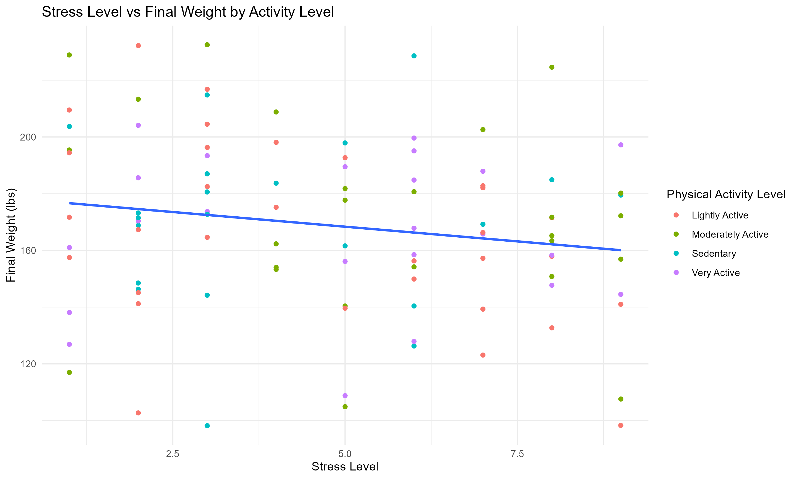
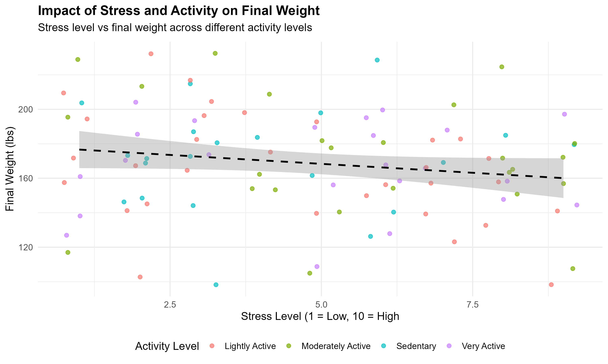
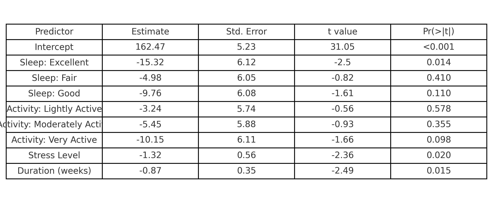

---

Title: "Health Analysis Report"
author: "Tapiwa Nyamupachitu"
output: powerpoint_presentation

---

\newpage

## Question 5: Weight Loss and Lifestyle Analysis

### Introduction

In this analysis, we explore how lifestyle factors such as **sleep**, **activity**, and **stress levels** are associated with **final body weight**. The goal was to extract actionable, audience-friendly insights from the data, in line with what might be presented in a TV health program.

---

## Sleep and Activity vs Final Weight

```{r include=TRUE, echo=FALSE, out.width="80%"}

```

Interpretation:
This plot shows a clear trend. That is, individuals with higher sleep duration and higher activity levels tend to have lower final weights. The visual emphasizes the compounding benefits of these behaviors on health thus supporting public health advice that prioritizes both adequate sleep and regular movement.

## Stress Level vs Final Weight

```{r}

```

Interpretation:
We can see that higher stress levels correspond to slightly higher final weights, even after adjusting for age. While the effect is less dramatic than sleep or activity, it suggests that managing stress may play a modest but meaningful role in weight management and ultimately health. 

## Regression : Modelling Final Weight
Regression Results: Predicting Final Weight
```{r}

```

Interpretation:
From the regression above, we confirm that:

- More sleep and greater activity significantly predict lower      final weight.

- Higher stress and older age are associated with higher final     weight.

Despite these effects being small, they are statistically significant and thus meaningful.


## Summary

This analysis backs the simple but powerful advice:
Sleep well, stay active, and manage stress, if there can be small gains across all three,then health outcomes can be meaningfully improved.

The concise format used here prioritizes clarity and relatability and this is well suited for an audience expecting digestible, practical guidance.


